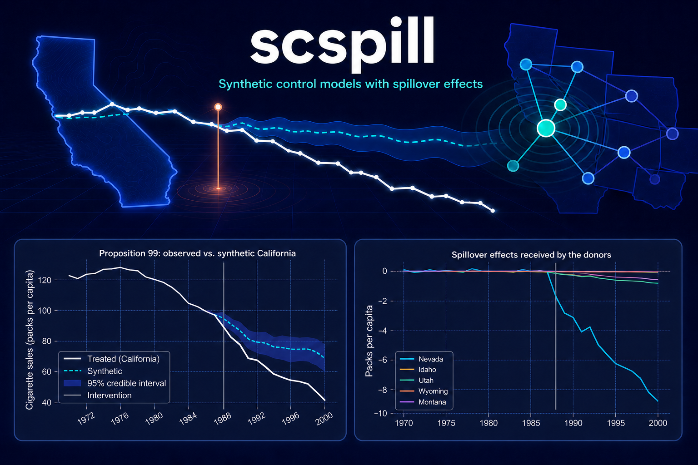

---
---

{fig-align="center" fig-alt="scspill — conceptual spillover network above dark-themed observed-versus-synthetic California and donor spillover plots"}

::: {.text-center}
**Synthetic control when the treatment leaks: estimate the policy effect *and* the spillover received by every donor.**
:::

**scspill** is a Python package of synthetic control models with spillover
effects. Classical synthetic control assumes the donors are untouched by the
treatment; when a policy spills across borders or trade links, that
assumption fails and the estimate is biased. Every model here drops it, and
every model returns two things classical synthetic control cannot both give
you: the effect on the treated unit, purged of contamination, and the
spillover effect received by each donor.

One model ships today — [`sar`](models/sar.qmd), the Bayesian
spatial-autoregressive method of Sakaguchi & Tagawa (*Identification and
Bayesian Inference for Synthetic Control Methods with Spillover Effects*, The
Econometrics Journal), which models the leakage through user-supplied spatial
weights, a horseshoe-regularized donor fit, and one estimated spillover
intensity $\rho$. The [model catalogue](models/index.qmd) lists it, names the
models on the roadmap, and marks plainly which are implemented.

```{=html}
<div class="hero-cta">
  <a class="xpd-btn xpd-btn--app" href="get-started.qmd">Get started &rarr;</a>
  <a class="xpd-btn xpd-btn--ghost" href="models/index.qmd">Browse the models</a>
  <a class="xpd-btn xpd-btn--ghost" href="https://github.com/quarcs-lab/scspill" target="_blank" rel="noopener">&#11088; Star on GitHub</a>
</div>
```

::: {.grid}

::: {.g-col-12 .g-col-md-4 .module-card}
### [🎯 Estimate](get-started.qmd)
Pick a model, configure once, fit once. Today that model is **`sar`**:
`SCSPILL(config).fit()` runs the **two-step Bayesian sampler** and returns the ATT with credible intervals, the counterfactual
path, the posterior of $\rho$, and a **time-by-donor spillover panel**.

```{=html}
<div class="module-card__links">
  <a href="https://colab.research.google.com/github/quarcs-lab/scspill/blob/main/notebooks/california.ipynb" target="_blank" rel="noopener">▶ Open in Colab</a>
</div>
```
:::

::: {.g-col-12 .g-col-md-4 .module-card}
### [🔬 Validate](articles/validation.qmd)
`sar` ships its article's appendix machinery as first-class functions: the **Geweke joint distribution
test** of the sampler, **prior sensitivity** sweeps, and **prior predictive
checks** against nine statistics of the donor panel.
:::

::: {.g-col-12 .g-col-md-4 .module-card}
### [🎲 Simulate](articles/simulation-study.qmd)
`sar`'s **Monte Carlo engine**: plant $\rho$ and the treatment effect on
a lattice, watch classical SCM go wrong under spillovers, and score bias,
RMSE, and coverage across estimators.
:::

:::

## The models

| Model | `method` | Reference | Status |
|---|---|---|---|
| [Bayesian spatial-autoregressive spillover SCM](models/sar.qmd) | `"sar"` | Sakaguchi & Tagawa (2026), *Econometrics Journal* | **Available** |
| SCM with spillover effects | `"cd"` | Cao & Dowd (2019, rev. 2026) | Planned |
| Inclusive synthetic control | `"iscm"` | Di Stefano & Mellace (2024) | Planned |
| Partial-interference SCG | `"grossi"` | Grossi et al. (2025), *JRSS-A* | Planned |

The planned rows are a roadmap, not a feature list: they are not implemented
and their `method` names are rejected rather than silently substituted. The
[model catalogue](models/index.qmd) explains what each would assume, and why
having several matters — the assumptions are not nested, so two models
bracket the answer.

## What a `sar` fit needs and returns

The treated unit is matched by unconstrained, horseshoe-shrunk synthetic
weights $\alpha$ (donors can be excluded, weighted negatively, or extrapolated
— no simplex constraint). Spillovers travel through weights you specify:
`spatial_w` links the treated unit to each donor, `spatial_W` links donors to
each other, and a single scalar $\rho$ — estimated by random-walk Metropolis
inside a Gibbs sampler — scales the whole channel. At $\rho = 0$ the method
collapses exactly to the Bayesian horseshoe synthetic control.

| You provide | scspill returns |
|---|---|
| a long panel `df` (one row per unit-period) | `att`, `att_ci` — the treatment effect with credible interval |
| a 0/1 treatment column | the counterfactual path with a pointwise credible band |
| `spatial_w`, `spatial_W` — spatial weights by donor label | the posterior of $\rho$ (draws, interval, ESS, acceptance) |
| optional covariate columns | a $(T \times N)$ spillover panel with credible bands per donor |
|  | MCMC diagnostics and R-style plot panels |

## Bundled case studies

- **California Proposition 99** — 39 states, 1970–2000, per-capita cigarette
  sales, rook-contiguity weights (`scspill.data.load_california()`): the
  paper's tobacco-tax application where the spillover lands on Nevada.
- **The 2011 Sudan secession** — 34 African countries, 2000–2015, GDP per
  capita, bilateral-trade weights (`scspill.data.load_sudan()`): spillovers
  travel the trade network to Egypt and Kenya.

## Installation

```bash
pip install scspill            # NumPy/SciPy backend
pip install "scspill[numba]"   # + JIT-compiled samplers (~10x faster)
```

## At a glance

```python
from scspill import SCSPILL
from scspill.data import load_california

panel = load_california()
result = SCSPILL({**panel.config_kwargs(), "m_iter": 20_000, "burn": 10_000,
                  "seed": 42}).fit()

result.att, result.att_ci          # treatment effect on California
result.rho_hat, result.rho_ci      # spillover intensity
result.spillover_panel["Nevada"]   # the effect received by Nevada
result.plot(kind="panel")          # counterfactual | effect | top spillovers
```

## `sar` is validated, not just implemented

Every release is cross-validated against the authors' R replication package
(see the [validation article](articles/validation.qmd) and
`benchmarks/REPORT.md` in the repository): the California and Sudan
posteriors are matched against the frozen R credible intervals, the Monte
Carlo grid against the paper's Tables 1–2, and the sampler itself passes the
Geweke joint distribution test — which also caught, and led us to fix, two
internal inconsistencies in the reference implementation's latent-factor
block.

## Built on

[numpy](https://numpy.org) · [scipy](https://scipy.org) ·
[pandas](https://pandas.pydata.org) · [pydantic](https://docs.pydantic.dev) ·
[matplotlib](https://matplotlib.org) · optional
[numba](https://numba.pydata.org) — and designed to sit beside
[mlsynth](https://github.com/jgreathouse9/mlsynth), whose estimator
architecture it shares.

## Citing

Please cite both the software and the article it implements:

> Mendez, C. (2026). *Synthetic Control Models with Spillovers in Python*
> (version 0.2.1). <https://github.com/quarcs-lab/scspill>

> Sakaguchi, S., & Tagawa, H. (2026). Identification and Bayesian Inference
> for Synthetic Control Methods with Spillover Effects. *The Econometrics
> Journal*. <https://doi.org/10.1093/ectj/utag006>

`CITATION.cff` in the repository carries the same metadata in
machine-readable form.

## Acknowledgement

The `sar` model and its original R/C++ implementation are the work of Shosei
Sakaguchi and Hayato Tagawa; please cite their article whenever you fit that
model. The Python package — an independent port with paper-correct defaults —
is written and maintained by Carlos Mendez at the
[QuaRCS lab](https://quarcs-lab.org).
